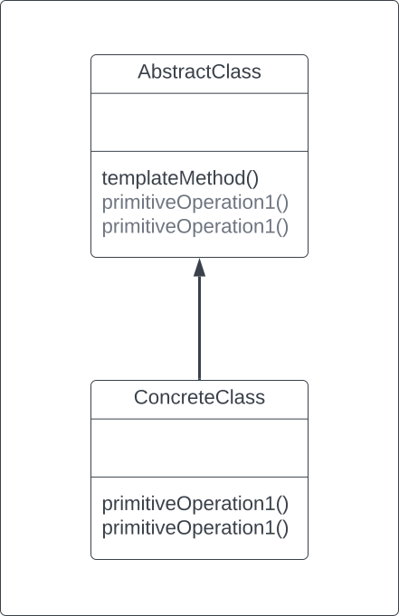
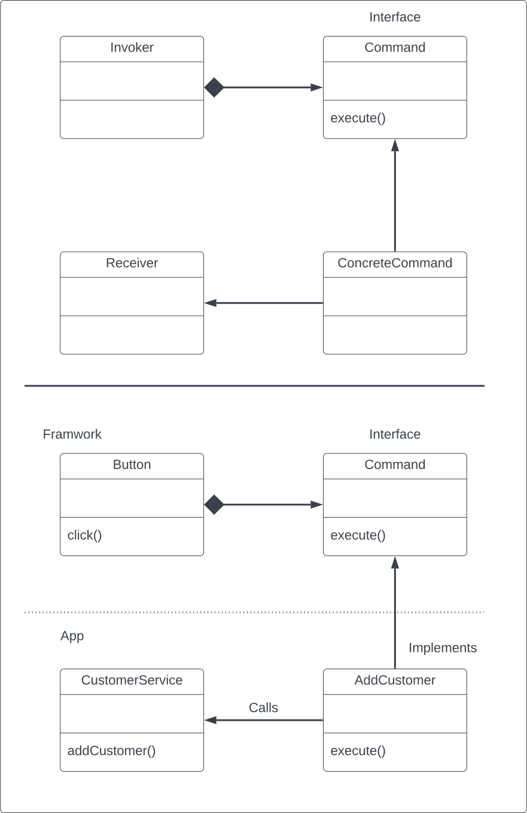

# Design Patterns
A simple project to learn about design patterns in software engineering.

## Momento Pattern

## State Pattern

## Iterator Pattern

## Strategy Pattern

## Template Method Pattern

## Command Pattern
