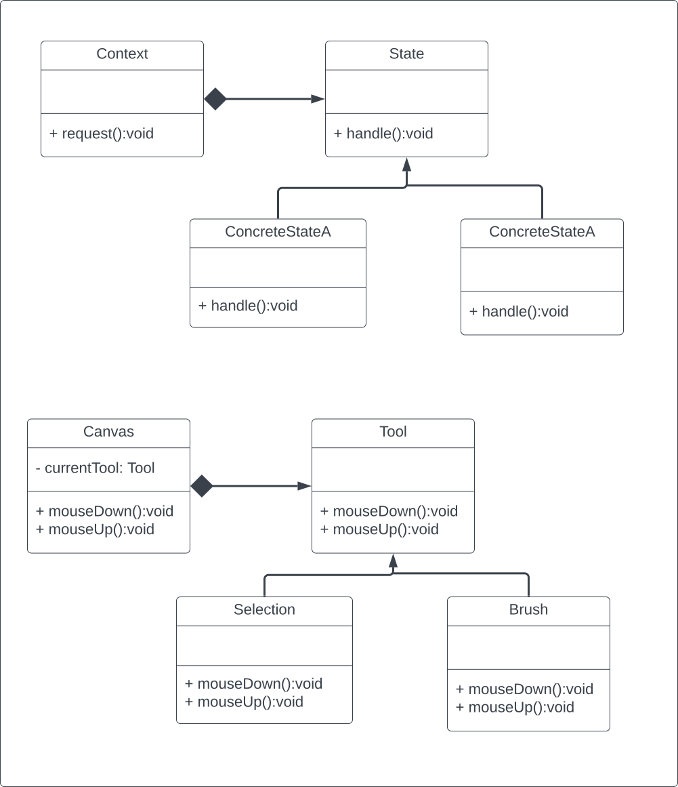

# Design Patterns
A simple project to learn about design patterns in software engineering.

## Momento Pattern

## State Pattern

## Iterator Pattern

## Strategy Pattern

## Template Method Pattern

## Command Pattern

### Undo Command 

## Observer Pattern

## Mediator Pattern

## Chain of Responsibility Pattern

## Visitor Pattern

## Composite Pattern

## Adapter Pattern

An Adapter design pattern is meant to:
- Wrap the adaptee and expose a target interface to the client.
- Indirectly change the adaptee`s interface into one that the client is expecting by implementing a target interface.
- Indirectly translate the client`s request into one that the adaptee is expecting.
- Reuse an existing adaptee with an incompatible interface.

## Decorator Pattern

## Facade Pattern

A facade simply acts as a point of entry into your subsystem.

A facade design pattern: 
- Is a means to hide the complexity of a subsystem by encapsulating it behind a unifying wrapper called a facade class.
- Removes the need for client classes to manage a subsystem on their own, resulting in less coupling between the
  subsystem and the client classes.
- Handles instantiation and redirection of tasks to the appropriate class within the subsystem.
- Provides client classes with a simplified interface for the subsystem.
- Acts simply as a point of entry to a subsystem and does not add more functionality to the subsystem.

## Flyweight Pattern

## Bridge Pattern

## Proxy Pattern

## Prototype Pattern

## Singleton Pattern
- Enforces one and only one object of a Singleton class.
- Has the Singleton object globally accessible.

## Factory Pattern
If there are multiple clients that want to instantiate the same set of classes, then by using a Factory object, you 
have cut out redundant code and made the software easier to modify.

The Factory Method design intent is to define an interface for creating objects, but let the subclasses decide which
class to instantiate.

## Abstract Factory Pattern
Provides an interface for creating families of related objects.

## Builder Pattern
To separate the construction of object from its representation.

