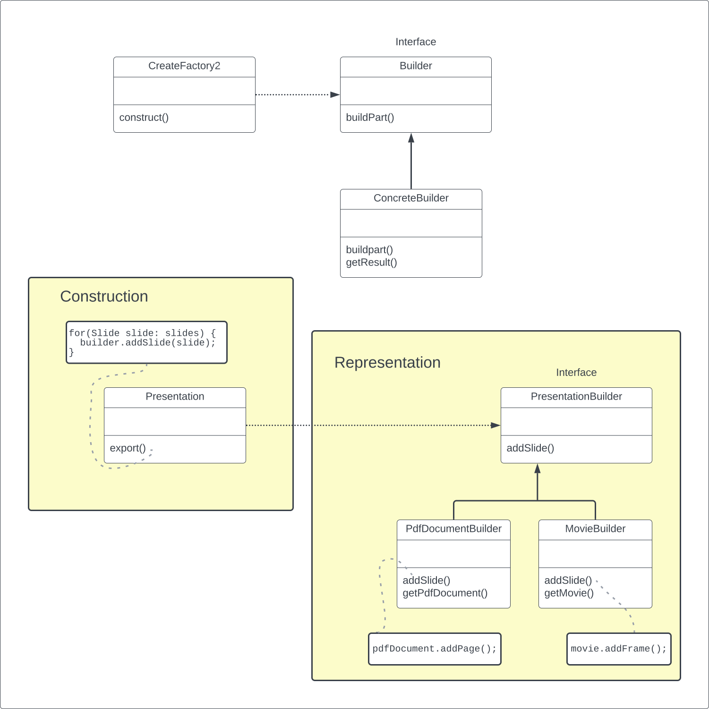

# Design Patterns
A simple project to learn about design patterns in software engineering.

## Momento Pattern

## State Pattern

The state pattern is useful when you need to change the behavior of an object based upon changes to its internal state. 
You can also use the pattern to simplify methods with long conditionals that depend on the object state.

## Iterator Pattern

## Strategy Pattern

## Template Method Pattern

The template method can be helpful if you have two classes with similar functionality. When you notice two classes 
with a very similar order of operations, you can choose to use a template method. The template method pattern is a 
practical application of generalization and inheritance. When writing software, you might notice two separate classes 
that share similarities like each having a method with a very similar algorithm. Rather than making changes to these 
algorithms in two places, you can consolidate the algorithms to one place within a template method of a superclass for 
the two classes. You generalize from two separate methods into one template method within a superclass which will be 
inherited by the two classes. The differences in the algorithms would be done through calls to abstract methods whose 
implementations are provided by the subclasses.

## Command Pattern

Command Pattern allows you to manipulate the commands as objects the way you could not do with method calls. Working 
with command objects allows you to add the functionalities like putting commands into queues and adding an undo/redo 
function. Another main benefit of the command pattern is that it decouples the objects of your software program. 
When you have a class that wants to make a request, that class doesn't need to know about the other objects in the 
software system. It can simply just create a command object and let the command object deal with the work by 
invoking the receiver objects, like with the boss memo example I mentioned earlier. The object doesn't need to know 
who deals with the request anymore, like how the boss doesn't need to know which worker will deal with the task. 
The command pattern also allows you to pull out logic from your user interfaces. Usually, code-to-handle requests is 
put into the event handlers of user interfaces. However, it doesn't really make sense to have a lot of application 
logic sitting in your user interface classes. The user interface classes should only be dealing with user interface 
issues like getting information to and from the user. Instead, the command pattern creates a new layer which is where 
these command objects will go.

### Undo Command 

## Observer Pattern

## Mediator Pattern

Mediator pattern will add an object that will talk to all of these other objects and coordinate their activities. 
Instead of objects being engaged in various pairwise interactions, they all interact through the Mediator. The 
communication between an object and the mediator is two-way: the object informs the mediator when something happens.

The objects associated with your mediator are called colleagues. You define an interface for the interactions between 
the mediator and colleagues, then instantiate a concrete mediator and concrete colleagues as necessary.

The communication could be implemented as an Observer pattern. Each Colleague is a subclass of the Observable class, 
and the Mediator is an Observer to each of them. In this case, the colleague should pass itself as a parameter to the 
mediator, so that the mediator knows to check that colleague instead of checking all of them. The communication could 
also occur through an event infrastructure.

## Chain of Responsibility Pattern

The Chain of Responsibility is a series of handler objects that are linked together. These handlers have methods that 
are written to handle specific requests. When a client object sends a request, the first handler in the chain will try 
to process it. If the handler can process the request, the request ends at this handler. If the handler cannot deal 
with the request, the handler will send the request to the next handler in the chain who will try to process the 
request. Again, if the handler cannot process the request, it will send the request onto the next handler. This passing 
of the request continues until we find the handler that can process the request. If the request goes through the entire 
chain of handlers and no handler can process it, then the request is not satisfied.

## Visitor Pattern

## Composite Pattern

The Composite Design Pattern achieves two goals. To compose nested structures of objects, and to deal with the classes 
for these objects uniformly. The pattern follows this basic design.

The composite design pattern is used to address:
- How do we use individual types of objects to build a tree-like structure? and
- How can we treat the individual types of objects uniformly without checking their types?

the composite design pattern is used to solve the issues of how to build a tree-like structure of objects, and how to 
treat the individual types of those objects uniformly. This is achieved by enforcing polymorphism across each class 
through implementing an interface or inheriting from a superclass. And using a technique called recursive composition, 
which allows objects to be composed of other objects that are of a common type.

## Adapter Pattern

An Adapter design pattern is meant to:
- Wrap the adaptee and expose a target interface to the client.
- Indirectly change the adaptee`s interface into one that the client is expecting by implementing a target interface.
- Indirectly translate the client`s request into one that the adaptee is expecting.
- Reuse an existing adaptee with an incompatible interface.

## Decorator Pattern
The key concepts for this design pattern are that:
- We can add in effect any number of behaviors dynamically to an object at runtime by using aggregation as a substitute 
  for pure inheritance. 
- Polymorphism is achieved by implementing a single interface. 
- Aggregation lets us create a stack of objects. 
- Each decorator object in the stack is aggregated in a one-to-one relationship with the object below it in the stack. 
- And, by combining aggregation and polymorphism, we can recursively invoke the same behavior down the stack and have 
  the behavior execute upwards from the concrete component object. 

Not only does the decorator design pattern let you dynamically modify objects, but it also reduces the variety of 
classes you would need to write. Using design patterns like the decorator pattern will help you create complex 
software without the complex overhead.

## Facade Pattern

A facade simply acts as a point of entry into your subsystem.

A facade design pattern: 
- Is a means to hide the complexity of a subsystem by encapsulating it behind a unifying wrapper called a facade class.
- Removes the need for client classes to manage a subsystem on their own, resulting in less coupling between the
  subsystem and the client classes.
- Handles instantiation and redirection of tasks to the appropriate class within the subsystem.
- Provides client classes with a simplified interface for the subsystem.
- Acts simply as a point of entry to a subsystem and does not add more functionality to the subsystem.

## Flyweight Pattern

## Bridge Pattern

## Proxy Pattern

The proxy design pattern provides your system with a powerful means of indirection. Proxy classes are robust and can 
let you build systems that are more secure and less resource-intensive.

The main features of the proxy design pattern are:

- to use the proxy class to wrap the real subject class,
- to have a polymorphic design so that the client class can expect the same interface for the proxy and real subject
  classes,
- to use a lightweight proxy in place of a resource intensive object until it is actually needed,
- to implement some form of intelligent verification of requests from client code in order to determine if, how,
  and to whom the requests should be forwarded to,
- and to present a local representation of a system that is not in the same physical or virtual space.

## Prototype Pattern

## Singleton Pattern
- Enforces one and only one object of a Singleton class.
- Has the Singleton object globally accessible.

## Factory Pattern
If there are multiple clients that want to instantiate the same set of classes, then by using a Factory object, you 
have cut out redundant code and made the software easier to modify.

The Factory Method design intent is to define an interface for creating objects, but let the subclasses decide which
class to instantiate.

## Abstract Factory Pattern
Provides an interface for creating families of related objects.

## Builder Pattern
To separate the construction of object from its representation.

